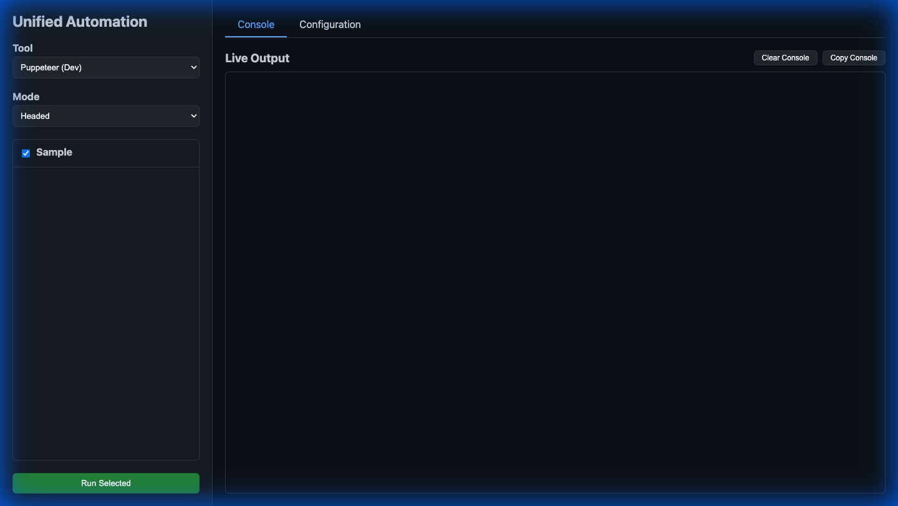
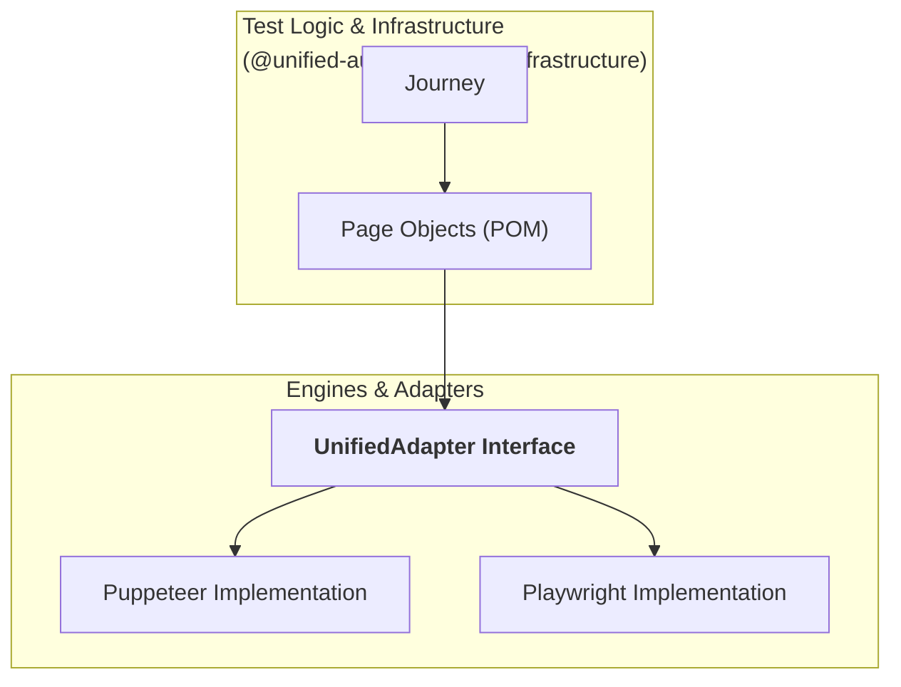

# 💎 Unified Automation Framework



A portable, drop-in browser automation framework designed for professional-grade developer experience.
This framework unifies test logic across multiple browser engines (Puppeteer, Playwright) and provides an enterprise-standard architecture for scalable testing.

---

## 🚀 Key Features

*   **Unified API**: Write journeys once using a standardized `UnifiedAdapter`.
*   **Page Object Model (POM)**: Enforced decoupling of test logic and element selectors.
*   **Dynamic Discovery**: Automatic loading of journey files—no manual registration required.
*   **Dual-Engine Support**: Run the same journey with Puppeteer (Dev) or Playwright (CI).
*   **Interactive Dashboard**: A web-based UI for triggering journeys, managing config, and **viewing integrated Playwright reports**.

---

## 📦 Project Structure

```text
unified-automation/
├── packages/
│   ├── adapters/            # THE ENGINES: Unified interface (Puppeteer/Playwright)
│   ├── test-infrastructure/ # THE TESTS: Journeys, Page Objects, and Templates
│   ├── puppeteer-runner/    # PUPPETEER: CLI for local development (Fast)
│   ├── playwright-runner/   # PLAYWRIGHT: CLI for CI/E2E and rich reporting
│   ├── test-runner-ui/      # THE DASHBOARD: Web UI for all execution
│   └── test-app/            # THE TARGET: Mock application for sandbox testing
└── README.md
```

---

## 🏁 Getting Started

### 1. Installation

```bash
git clone <repository-url>
cd unified-automation
npm install
```

### 2. Launch the Environment
The framework comes with a built-in test application and dashboard.

```bash
# Terminal 1: Start the Dashboard and Mock App
npm start
```
*   **Dashboard**: [http://localhost:3001](http://localhost:3001)
*   **Mock App**: [http://localhost:3002](http://localhost:3002)

### 3. Run a Sample Journey (Puppeteer/Dev)
```bash
cd packages/puppeteer-runner
npm run execute -- sample
```

### 4. Run Playwright Tests (CI/E2E)
```bash
cd packages/playwright-runner
# Run all tests
npm run test

# Run a specific journey
npm run test-single -- -g sample
```

---

## 🛠️ The Core Workflow (Adding New Tests)

Adding a new test follows a strict two-phase process to ensure maintainability.

### Phase 1: Define the Page Object
**Location**: `packages/test-infrastructure/src/page-objects/`

> [!TIP]
> **Stuck on boilerplate?** Use the [Blank Page Template](packages/test-infrastructure/src/templates/blank.page.ts) as a starting point.

Page Objects encapsulate the "how"—the selectors and low-level interactions. They should never contain business logic, only descriptive methods.

1.  **Create a file**: `my-feature.page.ts`
2.  **Implement the class**: Extend `BasePage`.

```typescript
import { BasePage } from './BasePage';

export class LoginPage extends BasePage {
  // 1. Private Selectors (use data-testid)
  private readonly usernameInput = '[data-testid="user-field"]';
  private readonly loginButton = '[data-testid="submit-btn"]';

  // 2. Descriptive Actions
  async login(user: string, pass: string) {
    await this.adapter.fill(this.usernameInput, user);
    await this.adapter.fill('[data-testid="pass-field"]', pass);
    await this.adapter.click(this.loginButton);
  }

  // 3. Declarative Verifications
  async verifyLoginError() {
    const isVisible = await this.adapter.isVisible('.error-state');
    if (!isVisible) throw new Error("Expected login error was not shown");
  }
}
```

### Phase 2: Create the Journey
**Location**: `packages/test-infrastructure/src/journeys/`

> [!TIP]
> **Ready to orchestrate?** Use the [Blank Journey Template](packages/test-infrastructure/src/templates/blank.journey.ts) to scaffold your user flow.

Journeys encapsulate the "what"—the user flow and orchestration of Page Objects. 

1.  **Create a file**: `login-failure.journey.ts`
2.  **Implement the class**: Extend `BaseJourney`.

```typescript
import { BaseJourney } from '../BaseJourney';
import { LoginPage } from '../page-objects/login.page';

export class LoginFailureJourney extends BaseJourney {
  async execute() {
    const loginPage = new LoginPage(this.adapter);

    // Orchestrate the flow
    await loginPage.login('wrong-user', 'bad-password');
    await loginPage.verifyLoginError();
  }
}
```
*Note: Navigation to `APP_URL` is handled automatically by the `BaseJourney` setup phase.*

---

## 🔌 Extending the Adapter (Custom Controls)

Sometimes standard `.click()` or `.fill()` isn't enough for complex custom controls (e.g. specialized Date Pickers or 3D viewports).

1.  **Update Interface**: Add the method to `packages/adapters/src/unified-adapter.interface.ts`.
2.  **Implement in Puppeteer**: Add logic to `packages/adapters/src/puppeteer.adapter.ts`.
3.  **Implement in Playwright**: Add logic to `packages/adapters/src/playwright.adapter.ts`.
4.  **Use in Page Object**: Call your new method via `this.adapter.myCustomMethod()`.

> [!NOTE]
> Check the [Specialized Adapter Example](packages/adapters/src/examples/specialized-adapter.example.ts) for a reference implementation of custom UI controls.

---

## 🎯 Element Selection Best Practices

1.  **Priority 1: `data-testid`**: Always the best choice. Resilient to styling changes.
2.  **Priority 2: ARIA Roles**: Good for accessibility (e.g. `[role="button"]`).
3.  **Forbidden: Deep CSS/XPath**: Never use `div > div > span > button`. These break if a single wrapper is added to the UI.

---

## ⚙️ Configuration

Settings are managed in `packages/test-infrastructure/src/config/config.ts` and can be overridden via environment variables or the **Dashboard Configuration Tab**.

| Variable | Description | Default |
| :--- | :--- | :--- |
| `APP_URL` | The application to test | `http://localhost:3002` |
| `HEADLESS` | Run browser in background | `false` |
| `CLOSE_BROWSER` | Exit browser after test completion | `false` |
| `CHROME_USER_DATA_DIR` | Path to a custom Chrome profile | `undefined` |

---

## 🛠️ The Orchestration Layer (Dashboard)

The `test-runner-ui` serves as the centralized hub for the entire framework. It is a Node.js Express server that coordinates the other packages:

*   **Discovery**: Scans `test-infrastructure` to find and list available journeys.
*   **Execution**: Spawns child processes using either `puppeteer-runner` (for Puppeteer) or `playwright-runner` (for Playwright).
*   **Real-time Feedback**: Streams stdout/stderr from the runners directly to the web console via WebSockets.
*   **Reporting**: Serves the static HTML reports generated by Playwright for deep post-test analysis.

---

## 🏛️ Architecture: The Unified Adapter Pattern

At the heart of this framework is the **Unified Adapter Pattern**, which decouples your test logic from the underlying browser engine.



---
*Created with ❤️ for professional automation teams.*
